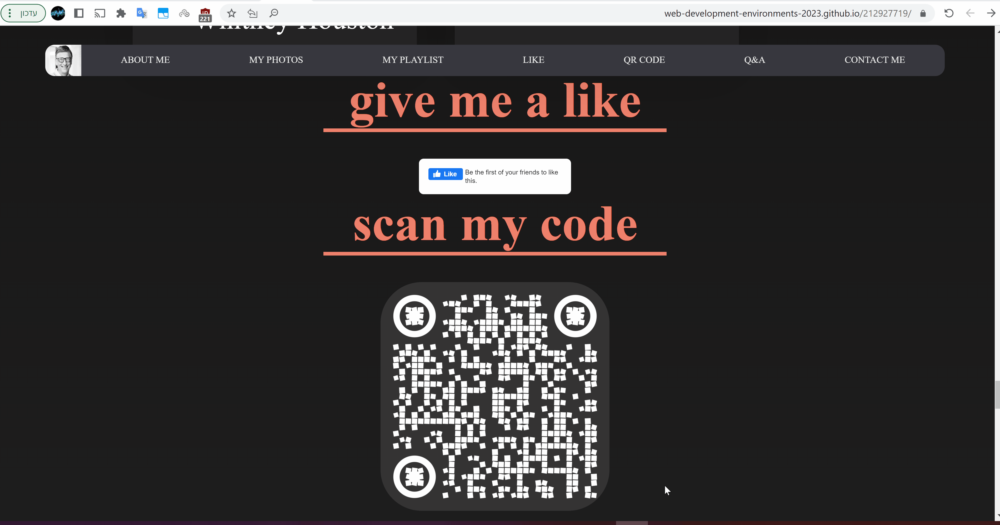
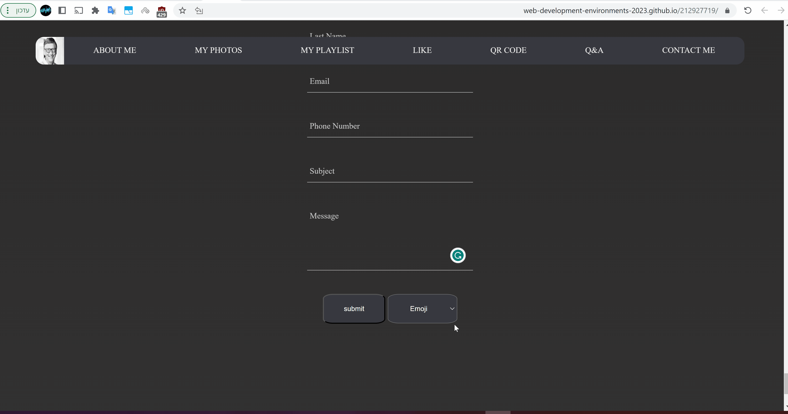

# Print("Hello World!")

Hi! welcome to my site. in my site you can found a lot of information about bill gates.
You can watch bill's photos.

You can atch his playlist and by hoverting with your mouse you can see and play the song.

You can give like and scan a qr code.

You can read ad learn about web1, web2 and web3.

You can add emojis to the messege.

And you can navigate using the menu.

